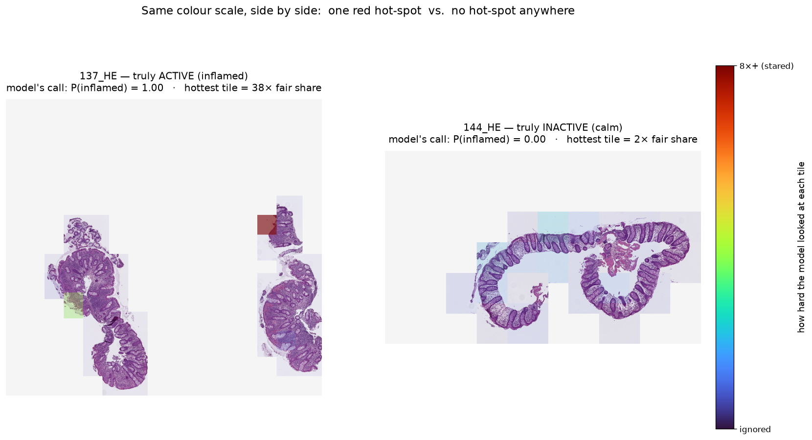

# IBD H&E — Inflamed vs Healed

> A computational-pathology prototype that turns an H&E whole-slide image of a colon biopsy into a
> per-region **inflamed-vs-healed** heatmap, with leakage-aware validation — built entirely on a
> **frozen** pathology foundation model (no encoder training) on **public** data.

> ⚠️ **Research & learning prototype. Not a medical device, not validated for clinical use.**



*Left: an **active** slide — the model highlights the one inflamed region. Right: a **healed** slide — nothing
lights up. The model was trained on slide-level labels only; nobody marked individual tiles.*

---

## What it does

Inflammatory bowel disease (Crohn's, ulcerative colitis) biopsies are graded by pathologists as **active**
(neutrophils attacking the gut lining) vs **healed** — a manual, subjective call that guides treatment. This
project predicts that call per slide **and** produces a per-tile heatmap of *where* the inflammation is, so a
human can check the evidence.

## The two approaches, explained

A whole biopsy slide is cut into hundreds of small **tiles** (little tissue patches). We only know **one
label for the whole slide** — "active" (inflammation present) or "healed" — and **not which tiles** show it.
That's the catch: active inflammation is often **focal** — neutrophils crowding the gut lining, cryptitis, a
crypt abscess in just a few tiles — while most of the slide still looks normal.

First, every tile is turned into a **fingerprint**: a list of numbers describing what that patch of tissue
looks like (produced by the frozen foundation model). Both approaches work on these fingerprints.

**Approach 1 — Mean-pool baseline (average the whole slide).**
Average all the tiles' fingerprints into one fingerprint for the slide, then a simple classifier calls it
active or healed. Fast, and good enough to make the *call* — but averaging blends a few inflamed tiles in
with hundreds of normal ones, so a **small inflamed focus gets diluted**. And because the slide is now a
single averaged number, it **can't show where** the inflammation is — there's no map.

**Approach 2 — Attention-MIL (let the model weigh each tile).**
Keep the tiles separate. A small network learns an **attention weight** for each tile — how much it should
count toward the verdict. A tile that looks inflamed counts a lot; a calm, normal tile counts almost nothing.
The model pools the tiles by that weighting and then classifies. It is trained on **slide labels only** — but
the only way to correctly call a focal slide "active" is to put its weight on the few inflamed tiles. So the
learned weights double as the **heatmap**: colour each tile by its weight and you see the exact region that
drove the call.

**What we found:** both score about the same (AUROC **0.984** vs **0.976**) — averaging is already enough to
*call* the slide. Attention-MIL's real value is the **map** — the inflamed region a pathologist can check.
(Honestly, neither reliably catches the *very* focal cases yet — see [Limitations](#limitations).)

## Results

Evaluated **leave-patients-out** (a patient's slides never straddle the train/test split) on 140 H&E slides:

| Head | AUROC | What it adds |
|---|---|---|
| Mean-pool + logistic regression (baseline) | **0.984** | the slide-level active/healed call |
| Gated attention-MIL (Step 5) | **0.976** | a per-tile **heatmap** — the *where* |

- **No leakage:** shuffling the labels collapses AUROC to **0.52**.
- **Limitation:** the MIL head does **not** beat the baseline on the number, and **focal disease** (a
  tiny inflamed spot in otherwise-normal tissue) is **missed by both heads**. The heatmap, not a higher score,
  is the deliverable. See the deck's "disease is a spectrum" slide.

## How it works

```
whole-slide image → tiles → [ frozen H-optimus-0, 1.1B-param ViT ] → 1,536-d embedding per tile (cached)
                                                                   → light head → stitched heatmap
```

One **frozen** pathology foundation model encodes tiles into embeddings; every model on top is a *light head*
trained on the cached embeddings. The pretraining is done up front — so the trainable parts are tiny and run on
a laptop GPU.

## What the foundation model does (H-optimus-0, by Bioptimus)

**H-optimus-0** is a *pathology foundation model* from [Bioptimus](https://www.bioptimus.com): a large vision
Transformer (~1.1 billion parameters) **pre-trained on a very large collection of H&E histopathology slides**,
with **no task labels** — by self-supervision (it learns the structure of tissue much like a large language
model learns the structure of text). The upshot: it already "knows" what nuclei, glands, stroma and
inflammation *look like* in stained tissue, before we ask it anything.

**What it does for us:** it turns each 224×224 tile into a **1,536-number embedding** (a "fingerprint") that
summarizes what's in that patch — cell density, gland architecture, how ordered or disordered the tissue is.
We run it **frozen** (inference only, never trained), once per tile, and cache the result; every head we build
sits on those fingerprints.

**Why that's powerful — concrete examples from this project:**

- **Similar tissue → similar fingerprint.** Two normal crypt-ring tiles land close together in
  fingerprint-space; an eroded, neutrophil-dense tile lands far away. Distance ≈ difference in histology.
- **The inflammation signal is already there, with the encoder untrained.** A plain logistic regression on the
  *averaged* fingerprints separates active vs healed at **AUROC 0.98** — and even the **single most useful** of
  the 1,536 numbers separates at **0.87**. We never taught it inflammation; the pretraining captured it.
- **It organizes tissue on its own.** Plotting every tile's fingerprint (t-SNE) shows a smooth
  **normal → inflamed gradient**, with the confidently-inflamed tiles clustering together — structure the
  model found by itself (see the deck's tile-embedding map).

**Why we don't train it:** the expensive part — learning general tissue morphology from a huge image corpus —
is already done, so we only train a **tiny head** for our specific active-vs-healed question. That's why this
runs on a laptop and needs no GPU cluster or millions of labelled IBD slides. The encoder is also
**swappable**: `H0-mini`, `UNI2`, or `Virchow2` drop into the same slot (pick by a probe on held-out IBD
slides, not oncology leaderboards).

**Architecture (what we loaded).** A **ViT-giant/14** in the DINOv2-with-registers configuration
(`timm` id `vit_giant_patch14_reg4_dinov2`): ~**1.13 B** parameters, **40** transformer blocks, **24**
attention heads, **1,536**-d embeddings, SwiGLU MLPs with LayerScale, and **4** register tokens. Each
**224×224** tile becomes **256** patches of **14×14** px → tokens → 40 blocks → the **CLS token** is the
1,536-d fingerprint we cache. Loaded frozen via
`timm.create_model("hf-hub:bioptimus/H-optimus-0", pretrained=True, init_values=1e-5, dynamic_img_size=False)`,
with H-optimus-0's H&E normalization (mean `(0.707, 0.579, 0.704)`, std `(0.212, 0.230, 0.178)`).

## Repository layout

```
src/ibdpath/      reusable module: paths, manifest parsing, labels, embedding cache, baseline, MIL head, mosaics
scripts/          numbered pipeline (01 build manifest → 05 attention-MIL) + figure/gallery builders
tests/            unit/integration tests (38) — run per-env (see below)
metadata/         slide_labels.csv — curated slide→active/inactive labels (derived; committed)
slides/           index.html (full build log) · overview.html (5-slide summary) · NOTES.md · images/
artifacts/        generated tables, embeddings, figures, galleries  (git-ignored)
data/             you download the dataset here                       (git-ignored)
REFERENCES.md     citations & attribution    ·    APPROACH.md  plain-language walkthrough
```

## Setup

Two virtual environments (the embedding/MIL step needs PyTorch; everything else stays light):

```bash
# light env — analysis, baseline, plotting  (Python 3.11+)
python3 -m venv .venv
.venv/bin/pip install numpy pandas pillow tifffile scikit-learn matplotlib h5py

# heavy env — embedding + attention-MIL  (Python 3.12; pulls in torch/timm)
python3.12 -m venv .venv-embed
.venv-embed/bin/pip install torch timm scikit-learn matplotlib pandas pillow
```

## Get the data (not hosted here — linked)

The dataset is **not** redistributed in this repo; download it from the source:

- **IBDColEpi** (CC0 public domain) — DataverseNO `doi:10.18710/TLA01U`, or the
  [HuggingFace mirror](https://huggingface.co/datasets/andreped/IBDColEpi). This project uses the **pre-tiled
  H&E patch set**; place it at `data/ibdcolepi/patch-dataset-HE.zip`.
- **H-optimus-0** weights are **gated** on HuggingFace — request access, then authenticate in the heavy env:
  ```bash
  .venv-embed/bin/hf auth login        # needs read access to bioptimus/H-optimus-0
  ```

## Run the pipeline

```bash
.venv/bin/python        scripts/01_build_manifest.py     # patch zip → artifacts/patch_manifest.csv
.venv/bin/python        scripts/02_attach_labels.py      # + active/inactive + patient_id
.venv-embed/bin/python  scripts/03_embed_tiles.py        # frozen H-optimus-0 → cached embeddings
.venv/bin/python        scripts/04_baseline_clf.py       # mean-pool + logreg → AUROC 0.984
.venv-embed/bin/python  scripts/05_mil_head.py           # attention-MIL → AUROC 0.976 + heatmaps
# figures & review gallery (optional):
.venv/bin/python        scripts/make_review_gallery.py
.venv/bin/python        scripts/make_disease_spectrum.py
.venv/bin/python        scripts/make_overview_figs.py
```

Tests:

```bash
.venv/bin/python -m unittest tests.test_manifest tests.test_labels tests.test_embed tests.test_baseline
.venv-embed/bin/python -m unittest tests.test_mil
```

## Slides

- `slides/index.html` — the full build log (every step, with evidence).
- `slides/overview.html` — a standalone **5-slide** overview for someone seeing the work for the first time.

Open either in a browser; navigate with arrow keys / space.

## Limitations

- Slide-level labels only; **focal** disease (a small inflamed focus) is the hard, unsolved case here.
- Slide-level "active" = intraepithelial neutrophils; cell-level neutrophil confirmation is **deferred** (a
  future head on the same embeddings, e.g. CellViT/HoVer-Net).
- Single public cohort (NTNU / St. Olavs). No external/multi-center validation. Not a clinical tool.

## Roadmap

v1 (Steps 1–6) is complete. Planned next steps — each a new head on the **same** frozen embeddings — are in
**[`ROADMAP.md`](ROADMAP.md)**. The strongest is **cell-level quantification** (cell type & inflammation
status per tile, toward Geboes / Nancy / Robarts); a concrete first-slice plan with the feasibility gates is
in **[`docs/cell-quantification-plan.md`](docs/cell-quantification-plan.md)**.

## References & citation

Full citations (dataset, model, method, libraries, tools) are in **[`REFERENCES.md`](REFERENCES.md)**. If you
use this, please cite the dataset:

> Pettersen, H. S., et al. (2021). *Code-Free Development and Deployment of Deep Segmentation Models for Digital
> Pathology.* Frontiers in Medicine, 8:816281. Dataset: `doi:10.18710/TLA01U` (DataverseNO, CC0).

## License

- **Code** in this repository: **MIT** — see [`LICENSE`](LICENSE).
- **IBDColEpi dataset**: CC0 (public domain); not redistributed here — linked above. Result figures contain
  small tile excerpts under that license, with citation.
- **Teaching H&E images** in the deck (cryptitis / crypt-abscess): Wikimedia Commons, CC-BY-SA, by *Nephron*.

## Disclaimer

This is an independent research/learning project. It is **not** affiliated with the dataset authors or
Bioptimus, has **not** been clinically validated, and must **not** be used for diagnosis or treatment.
